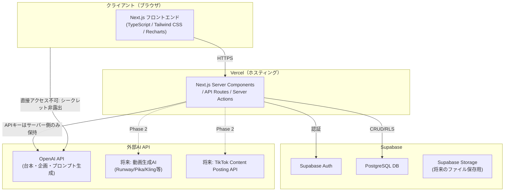
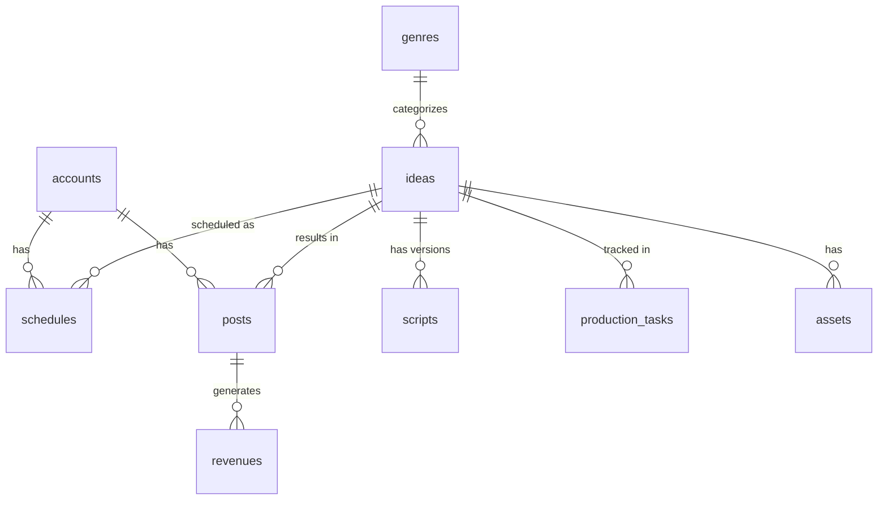

# TikTok AI動画メディア事業管理Webアプリ MVP開発計画

> プログラミング初心者の個人が、TikTokを中心としたAI動画メディア事業を管理・運営できる日本語対応Webアプリのための、要件整理とMVP開発計画ドキュメントです。

## 前提となる決定事項（ヒアリング結果）

| 項目 | 決定内容 |
|---|---|
| AIワークフロー自動実行 | MVPでは自動実行（cron）を実装せず、ダッシュボードの「実行」ボタンで手動トリガー。Phase 2でVercel Cron等により自動化 |
| AI API | OpenAI API（GPT系）を台本・企画生成の主軸とする。動画生成AI（Runway/Pika/Kling等）はPhase 2、MVPでは映像プロンプトの生成のみ |
| 認証 | Supabase Auth（メール＋パスワード）。将来のマルチユーザー拡張を見据えた設計 |
| グラフライブラリ | Recharts |
| 動画ファイル保存 | MVPでは動画URLをリンクとして保存するのみ。ファイルアップロード機能はPhase 2 |

---

## 1. 要件の整理

### 機能要件
- ジャンル管理（登録・編集・削除、ジャンル別集計）
- 動画ネタ管理（登録、重複警告、100点スコアリング、承認フロー）
- 台本作成（フック／ナレーション／秒数構成／映像プロンプト、バージョン履歴）
- 制作ボード（カンバン形式のステータス管理、ドラッグ&ドロップ）
- 投稿カレンダー（月・週表示、予定変更、投稿集中・未承認の警告表示）
- 動画・素材管理（動画URL、サムネイル、AI音声、画像、字幕、権利確認フラグ）
- 分析（手入力・CSV取込、指標自動計算、期間／アカウント／ジャンル別グラフ）
- 収益管理（収益源別、月別売上・経費・利益）
- AI提案（次回企画、成功パターン分析、改善提案、根拠不足時の仮説明記）
- 複数SNSアカウント管理（TikTok中心、将来YouTube Shorts/Instagram Reels対応の型を持つ）
- 人間承認フロー（企画確定・台本確定・動画承認・公開・削除は必ずユーザー確認）
- 日本語UI（画面・ボタン・メニュー・エラーメッセージすべて日本語、専門用語に説明表示）

### 非機能要件
- レスポンシブ対応（スマホ・PC）
- APIキー・パスワードは環境変数管理、コードへの直書き禁止
- シークレットはブラウザ側に非露出（Server ActionsまたはAPI Routes経由でのみAI APIを呼ぶ）
- TikTokパスワード等の認証情報は保存しない
- TikTokの非公式自動操作・規約回避・無断転載機能は実装しない
- 誤操作防止（削除・公開ボタンは確認ダイアログ必須、承認ボタンは視覚的に強調）
- 規約リスク表示（低・中・高）、高リスクは自動保留
- 出典保存、事実断定禁止、誇大表現回避のガードレールをAI生成プロンプトに組み込む

---

## 2. MVPに含める機能

1. **認証**：Supabase Authによるメール＋パスワードログイン（1ユーザー想定だが複数ユーザー対応可能なテーブル設計）
2. **ダッシュボード**：今日の動画・承認待ち・投稿予定・簡易実績・簡易収益・AI提案の要約表示
3. **アカウント管理**：SNSアカウント登録（名前・プラットフォーム・メモ）、パスワードは保存しない
4. **ネタ管理**：企画のCRUD、タイトル類似度による簡易重複警告、100点スコアリング（手動入力＋AI提案スコア）
5. **台本作成**：フック／ナレーション／秒数構成／映像プロンプトの入力、AI生成ボタン（OpenAI API呼び出し）、バージョン履歴（過去バージョンの保存・比較）
6. **制作ボード**：ステータス列（企画→台本→制作中→確認待ち→完成）のカンバン、ドラッグ&ドロップでステータス変更
7. **投稿カレンダー**：月・週表示、予定のドラッグ移動、同日複数投稿の警告、未承認企画の警告表示
8. **動画・素材管理**：動画URL・サムネイルURL・音声URL・画像URL・字幕テキストの登録、権利確認チェックボックス
9. **分析画面**：実績の手入力フォーム、CSV取込（再生数・いいね数等）、自動計算（エンゲージメント率等）、Rechartsによる期間／アカウント／ジャンル別グラフ
10. **収益管理**：収益源別の入力、月別売上・経費・利益の集計表、税務ソフト代替ではない旨の注記表示
11. **AI提案画面**：手動トリガーで次回企画候補生成（OpenAI API）、成功パターンの簡易分析（既存実績データに基づく）、根拠不足時は「仮説」であることを明記
12. **AIワークフロー（手動トリガー版）**：
    - 「候補提示」ボタン→5件提示・スコアリング→2件選定→承認待ちへ
    - 「台本・素材指示作成」ボタン→承認済み企画のみ台本生成
    - 「当日まとめ」ボタン→完了状況の要約表示
    - 「週次分析」ボタン→先週の実績分析と新規企画10件提案
    - 設定画面でのAI機能の有効／無効切り替え（実行タイミングの表示のみ、実際の自動実行はPhase 2）
13. **承認フロー**：企画確定・台本確定・動画承認・公開記録・削除操作に確認ダイアログと承認ボタン
14. **初期データ**：架空TikTokアカウント1件、サンプル動画企画10件（実在人物・企業・商品を含まない、「サンプルデータ」ラベル表示）

---

## 3. 後回しにする機能（Phase 2以降）

| 機能 | 理由 |
|---|---|
| cron等による完全自動実行（毎日9/12/20時、毎週月曜） | Vercel Hobbyプランのcron制限、まず手動トリガーで安全に運用実績を積む |
| 動画生成AI（Runway/Pika/Kling等）連携 | API仕様・コストが変動しやすく、MVPでは台本・プロンプト生成に注力 |
| TikTok公式Content Posting API連携 | 審査・申請が必要で時間がかかるため、MVPは書き出し→手動投稿→実績登録に留める |
| 動画ファイルの直接アップロード・Supabase Storage管理 | MVPはURLリンク管理のみとし、ストレージ設計はPhase 2で検討 |
| YouTube Shorts / Instagram Reels対応 | データモデルに拡張余地は持たせるが、UI・連携はPhase 2以降 |
| 高度な重複検出（embeddingベースの類似度） | MVPは文字列類似度等の簡易判定に留める |
| 通知機能（メール・Push通知） | MVPは画面内表示のみ |
| マルチユーザー・権限管理（RBAC） | MVPは1ユーザー運用、テーブル設計のみ将来対応を考慮 |
| 高度な収益分析（税務連携、請求書発行） | 税務・会計ソフトの代替ではないと明記し、範囲外とする |

---

## 4. システム構成

### アーキテクチャ図

### 技術スタック詳細

| 分類 | 技術 | 備考 |
|---|---|---|
| フロントエンド | Next.js（App Router） / TypeScript / Tailwind CSS | レスポンシブ対応、日本語UI |
| グラフ | Recharts | 分析画面の各種チャート |
| バックエンド処理 | Next.js Server Actions / API Routes | AI API呼び出しはサーバー側のみ、シークレット非露出 |
| 認証 | Supabase Auth（メール＋パスワード） | 将来のマルチユーザー拡張を想定したテーブル設計 |
| DB | Supabase（PostgreSQL） | Row Level Security（RLS）でユーザー単位のデータ分離 |
| ストレージ | 未使用（MVPはURLリンク管理） | Phase 2でSupabase Storage検討 |
| ホスティング | Vercel | 環境変数でシークレット管理 |
| AI | OpenAI API | 環境変数（`OPENAI_API_KEY`等）で切替可能な抽象化層を設計 |
| CSV取込 | クライアント側パース（例：軽量CSVパーサー）→サーバーへ送信して保存 | 分析画面の実績取込用 |

---

## 5. データベース設計

すべてのテーブルに `user_id`（Supabase Auth の `auth.users.id` 参照）を持たせ、RLSでユーザー単位に分離する（将来のマルチユーザー対応を見据える）。

### `accounts`（SNSアカウント管理）
| カラム名 | 型 | 制約 |
|---|---|---|
| id | uuid | PK, default gen_random_uuid() |
| user_id | uuid | FK → auth.users.id, not null |
| platform | text | not null（'tiktok' / 'youtube_shorts' / 'instagram_reels'） |
| account_name | text | not null |
| memo | text | nullable |
| created_at | timestamptz | default now() |
| updated_at | timestamptz | default now() |

> パスワード等の認証情報カラムは持たない（非保存方針）。

### `genres`（ジャンル）
| カラム名 | 型 | 制約 |
|---|---|---|
| id | uuid | PK |
| user_id | uuid | FK, not null |
| name | text | not null |
| description | text | nullable |
| created_at | timestamptz | default now() |

### `ideas`（動画ネタ）
| カラム名 | 型 | 制約 |
|---|---|---|
| id | uuid | PK |
| user_id | uuid | FK, not null |
| genre_id | uuid | FK → genres.id, nullable |
| title | text | not null |
| description | text | nullable |
| score | int | nullable（0-100） |
| score_reason | text | nullable（AI採点根拠） |
| duplicate_flag | boolean | default false |
| status | text | not null, default 'candidate'（candidate/selected/approved/rejected） |
| source | text | nullable（'ai' / 'manual'） |
| created_at | timestamptz | default now() |
| updated_at | timestamptz | default now() |

### `scripts`（台本）
| カラム名 | 型 | 制約 |
|---|---|---|
| id | uuid | PK |
| user_id | uuid | FK, not null |
| idea_id | uuid | FK → ideas.id, not null |
| version | int | not null, default 1 |
| hook | text | nullable |
| narration | text | nullable |
| structure | jsonb | nullable（秒数構成の配列） |
| video_prompt | text | nullable（映像プロンプト） |
| risk_level | text | not null, default 'low'（low/medium/high） |
| is_approved | boolean | default false |
| approved_at | timestamptz | nullable |
| created_at | timestamptz | default now() |

### `production_tasks`（制作ボード）
| カラム名 | 型 | 制約 |
|---|---|---|
| id | uuid | PK |
| user_id | uuid | FK, not null |
| idea_id | uuid | FK → ideas.id, not null |
| status | text | not null, default 'planning'（planning/script/producing/review/done） |
| assignee_memo | text | nullable |
| order_index | int | default 0（カンバン内の並び順） |
| created_at | timestamptz | default now() |
| updated_at | timestamptz | default now() |

### `schedules`（投稿カレンダー）
| カラム名 | 型 | 制約 |
|---|---|---|
| id | uuid | PK |
| user_id | uuid | FK, not null |
| idea_id | uuid | FK → ideas.id, not null |
| account_id | uuid | FK → accounts.id, not null |
| scheduled_at | timestamptz | not null |
| status | text | not null, default 'planned'（planned/published/cancelled） |
| created_at | timestamptz | default now() |

### `assets`（動画・素材管理）
| カラム名 | 型 | 制約 |
|---|---|---|
| id | uuid | PK |
| user_id | uuid | FK, not null |
| idea_id | uuid | FK → ideas.id, not null |
| video_url | text | nullable |
| thumbnail_url | text | nullable |
| audio_url | text | nullable |
| image_urls | jsonb | nullable（配列） |
| subtitle_text | text | nullable |
| rights_checked | boolean | default false |
| is_approved | boolean | default false |
| approved_at | timestamptz | nullable |
| created_at | timestamptz | default now() |

### `posts`（投稿実績）
| カラム名 | 型 | 制約 |
|---|---|---|
| id | uuid | PK |
| user_id | uuid | FK, not null |
| idea_id | uuid | FK → ideas.id, not null |
| account_id | uuid | FK → accounts.id, not null |
| posted_at | timestamptz | nullable |
| views | int | default 0 |
| likes | int | default 0 |
| comments | int | default 0 |
| shares | int | default 0 |
| saves | int | default 0 |
| data_source | text | nullable（'manual' / 'csv'） |
| created_at | timestamptz | default now() |

### `revenues`（収益管理）
| カラム名 | 型 | 制約 |
|---|---|---|
| id | uuid | PK |
| user_id | uuid | FK, not null |
| post_id | uuid | FK → posts.id, nullable |
| account_id | uuid | FK → accounts.id, nullable |
| source_type | text | not null（'ad_revenue' / 'affiliate' / 'sponsorship' / 'other'） |
| amount | numeric(12,2) | not null |
| expense | numeric(12,2) | default 0 |
| record_date | date | not null |
| memo | text | nullable |
| created_at | timestamptz | default now() |

### `ai_suggestions`（AI提案）
| カラム名 | 型 | 制約 |
|---|---|---|
| id | uuid | PK |
| user_id | uuid | FK, not null |
| type | text | not null（'next_idea' / 'pattern_analysis' / 'improvement'） |
| content | jsonb | not null |
| basis_confidence | text | not null, default 'low'（'low'=仮説明記 / 'high'=データに基づく） |
| created_at | timestamptz | default now() |

### `ai_workflow_logs`（AIワークフロー実行履歴・手動トリガー記録）
| カラム名 | 型 | 制約 |
|---|---|---|
| id | uuid | PK |
| user_id | uuid | FK, not null |
| workflow_type | text | not null（'daily_candidates' / 'daily_script' / 'daily_summary' / 'weekly_analysis'） |
| triggered_at | timestamptz | default now() |
| result_summary | jsonb | nullable |

### `settings`（設定）
| カラム名 | 型 | 制約 |
|---|---|---|
| id | uuid | PK |
| user_id | uuid | FK, not null, unique |
| ai_enabled | boolean | default true |
| timezone | text | default 'Asia/Tokyo' |
| updated_at | timestamptz | default now() |

### リレーション概要

---

## 6. 画面一覧

### 1. ダッシュボード（`/dashboard`）
- **表示項目**：今日の投稿予定件数、承認待ち件数、直近実績サマリー、当月収益サマリー、AI提案の要約カード
- **操作**：各カードから該当画面へ遷移、AIワークフローの手動トリガーボタン
- **遷移**：ネタ管理・台本作成・投稿カレンダー・分析・収益管理・AI提案へ

### 2. アカウント管理（`/accounts`）
- **表示項目**：アカウント一覧（プラットフォーム・名前・メモ）
- **操作**：追加／編集／削除（削除は確認ダイアログ）
- **遷移**：なし（単独画面）

### 3. ネタ管理（`/ideas`）
- **表示項目**：企画一覧（タイトル・ジャンル・スコア・重複警告・ステータス）
- **操作**：新規追加、AIスコアリング実行、承認／却下、台本作成画面への遷移
- **遷移**：台本作成画面へ

### 4. 台本作成（`/scripts/[ideaId]`）
- **表示項目**：フック・ナレーション・秒数構成・映像プロンプト、バージョン履歴一覧
- **操作**：AI生成ボタン、手動編集、バージョン保存・比較、承認ボタン（強調表示）
- **遷移**：制作ボードへ

### 5. 制作ボード（`/production`）
- **表示項目**：カンバン列（企画→台本→制作中→確認待ち→完成）
- **操作**：ドラッグ&ドロップでステータス変更
- **遷移**：各カードから動画・素材管理へ

### 6. 投稿カレンダー（`/calendar`）
- **表示項目**：月表示／週表示切替、投稿予定、未承認警告、投稿集中警告
- **操作**：ドラッグで日時変更、新規予定追加
- **遷移**：動画・素材管理、分析画面（実績登録）へ

### 7. 動画・素材管理（`/assets/[ideaId]`）
- **表示項目**：動画URL・サムネイル・音声・画像・字幕、権利確認チェック状態
- **操作**：URL登録・編集、権利確認チェック、承認ボタン（強調表示）
- **遷移**：投稿カレンダーへ

### 8. 分析画面（`/analytics`）
- **表示項目**：期間／アカウント／ジャンル別グラフ（Recharts）、実績一覧
- **操作**：手入力フォーム、CSV取込、フィルター切替
- **遷移**：収益管理へ

### 9. 収益管理（`/revenue`）
- **表示項目**：収益源別一覧、月別売上・経費・利益表、注記（税務ソフト代替ではない旨）
- **操作**：収益・経費の登録・編集・削除（削除は確認ダイアログ）
- **遷移**：分析画面へ

### 10. AI提案画面（`/ai-suggestions`）
- **表示項目**：次回企画提案、成功パターン分析、改善提案（根拠不足時は「仮説」ラベル表示）
- **操作**：手動トリガーボタン（週次分析等）、提案をネタ管理へ取り込む操作
- **遷移**：ネタ管理へ

### 付随：設定画面（`/settings`）
- **表示項目**：AI機能の有効／無効、実行タイミング表示、タイムゾーン設定
- **操作**：トグル切替、保存

---

## 7. 開発工程（フェーズ分け）

| フェーズ | 作業内容 |
|---|---|
| **フェーズ0：基盤構築** | Next.jsプロジェクト初期化、Tailwind CSS導入、Supabaseプロジェクト作成、Auth設定、DBスキーマ作成（マイグレーション）、環境変数設計、Vercelデプロイ設定 |
| **フェーズ1：認証・共通レイアウト** | ログイン／ログアウト画面、共通ナビゲーション、日本語UIの基本コンポーネント（ボタン・警告表示・確認ダイアログ）作成 |
| **フェーズ2：コア管理機能** | アカウント管理、ネタ管理（重複警告・スコアリングUI）、台本作成（バージョン履歴含む）画面の実装 |
| **フェーズ3：制作・投稿管理** | 制作ボード（カンバンD&D）、投稿カレンダー（月/週・D&D・警告表示）、動画・素材管理画面の実装 |
| **フェーズ4：分析・収益・AI提案** | 分析画面（CSV取込・Recharts可視化）、収益管理、AI提案画面、OpenAI API連携（台本生成・企画提案）の実装 |
| **フェーズ5：AIワークフロー（手動トリガー版）・設定** | ダッシュボード統合、AIワークフロー4種の手動トリガーボタンと処理実装、設定画面、初期サンプルデータ投入 |
| **フェーズ6：仕上げ・検証** | レスポンシブ調整、日本語文言・エラーメッセージの精査、承認フローの誤操作防止確認、セキュリティレビュー（環境変数・RLS確認）、E2E動作確認 |

> 各フェーズの見積り期間は本ドキュメントでは記載しません（要望に応じて別途提示可能です）。

---

## 8. 必要になる外部サービス

| サービス名 | 用途 | 無料枠 | 想定月額（無料枠超過時） | 代替案 |
|---|---|---|---|---|
| Vercel | フロントエンド・API Routesホスティング | Hobbyプラン（個人利用は無料） | Pro: 約$20/月〜 | Netlify、Cloudflare Pages |
| Supabase | Auth／PostgreSQL DB | Freeプラン（500MB DB、Auth無制限ユーザー等） | Proプラン: 約$25/月〜 | Firebase（要件との相性は要検討） |
| OpenAI API | 台本・企画・映像プロンプト生成 | 無料枠なし（従量課金、要クレジット） | 利用量に応じて変動（数百〜数千円/月想定） | Anthropic Claude API、Google Gemini API（環境変数切替） |
| （将来）Cloudflare R2等 | 動画ファイルストレージ | 無料枠あり（Phase 2検討） | 利用量次第 | Supabase Storage拡張 |
| （将来）TikTok Content Posting API | 公式投稿連携 | 無料（申請・審査必要） | 無料（API利用自体は無料想定） | 手動投稿の継続 |

---

## 9. 無料運用時と有料運用時の想定費用（月額）

| 項目 | 無料運用時 | 有料運用時（成長後） |
|---|---|---|
| Vercel | ¥0（Hobby） | 約¥3,000（Pro、$20換算） |
| Supabase | ¥0（Free） | 約¥3,800（Pro、$25換算） |
| OpenAI API | 数百円程度（少量利用） | ¥3,000〜¥10,000程度（利用量次第、要監視） |
| ストレージ（将来） | ¥0（未使用） | 数百円〜（利用量次第） |
| **合計目安** | **¥0〜数百円/月** | **約¥10,000〜20,000/月（利用量により変動）** |

> OpenAI APIは従量課金のため、利用量に応じたコスト監視・上限設定（Usage limits）を推奨します。

---

## 10. セキュリティ上の注意点

### 認証
- Supabase Authによるメール＋パスワード認証、セッション管理はSupabase側に委譲
- 将来のマルチユーザー化を見据え、全テーブルに`user_id`を保持しRLSで分離

### データ保護
- Row Level Security（RLS）を全テーブルに設定し、`auth.uid() = user_id`のみアクセス許可
- TikTok等SNSのログイン情報・パスワードは一切保存しない（アカウント管理はアカウント名・メモのみ）
- 削除操作（企画削除、投稿削除等）は確認ダイアログを必須とし、誤操作を防止

### API管理
- OpenAI APIキー等はVercel環境変数として管理し、コードへの直書き禁止
- AI API呼び出しはNext.jsのServer Actions／API Routes経由のみで実行し、クライアント（ブラウザ）にシークレットを一切渡さない
- 環境変数でAI APIプロバイダーを切替可能な抽象化層（アダプターパターン）を設計し、将来のプロバイダー変更・追加に対応

### AI生成コンテンツのガードレール
- 著作権侵害・無断転載を避けるプロンプト設計、出典情報の保存
- 事実断定を避ける表現ルール、誇大表現の回避
- 規約リスクレベル（低・中・高）の自動付与、高リスクは自動的に保留状態にして人間の確認を要求
