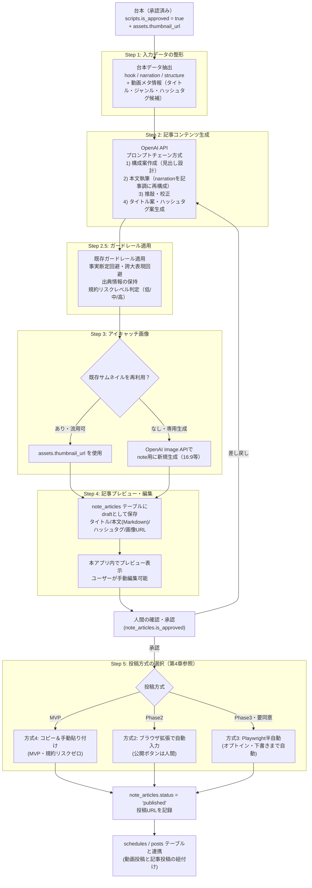

# note（note.com）記事自動投稿機能 連携調査・設計書

> TikTok AI動画メディア管理Webアプリに、TikTok動画と連動した note 記事の自動投稿機能を追加するための、連携可能性調査と推奨アーキテクチャ設計。

---

## 0. 結論の要約（先出し）

| 項目 | 結論 |
|---|---|
| note公式API | **存在しない**。noteヘルプセンターが公式に「現在、noteが公式で公開しているAPIはありません」と明言しており、今後の公開予定も未定 |
| 非公式API | `note.com/api/v1〜v3` 配下に非公式の内部APIが多数存在し、記事の下書き保存・公開・削除も技術的には可能。ただし**認証はCookie/セッションベースで外部トークン発行の仕組みがなく**、仕様変更が予告なく行われるリスクが高い |
| 規約リスク | 「自動化・bot利用」を単語で明示禁止する条項は見当たらないが、スパム行為・サーバー過負荷・運営が「支障」と判断した行為は禁止されており、**最終判断は運営の裁量**。機械的な大量投稿は明確にリスクが高い |
| 推奨する連携方式 | **「半自動投稿」方式を第一候補とする**：AIが記事を自動生成し、投稿は「note専用ブラウザ拡張 or ブックマークレット的な手動トリガー」または「Playwrightによるブラウザ自動化（低頻度・人間監督下）」で実施。**完全無人の自動公開は非推奨** |
| 代替プラットフォーム | **はてなブログ（AtomPub API, WSSE/OAuth認証）** と **Qiita API v2**（技術記事向けだが構造は参考になる）は公式APIがあり、完全自動化が容易。note文化への適合を優先するなら、はてなブログが有力な代替 |
| 記事自動生成 | 既存の`scripts`テーブル（台本データ）とOpenAI APIを使い、TikTok台本→note記事への変換パイプラインを新設可能。既存の`video-pipeline-design.md`の設計思想（サーバー側API呼び出し、人間承認ゲート）を継承する |
| 実装方針 | MVP：記事自動生成＋下書き手動コピー貼り付け（安全・規約リスクゼロ）。Phase 2：ブラウザ拡張／ブックマークレットによる「ワンクリック投稿」。Phase 3（任意・リスク要説明）：Playwright半自動投稿（低頻度・要人間確認） |

---

## 1. noteの公式API調査結果

### 1.1 公式APIの有無
- note株式会社のヘルプセンター記事「noteが公式で公開しているAPIはありますか？」にて、以下が明言されている：
  > 現在、noteが公式で公開しているAPIはありません。また、今後の公開予定や公開の可能性につきましても、現時点では未定となっております。
- 開発者向けドキュメント、OAuthクライアント登録画面、APIキー発行画面などは**一切存在しない**。
- note proのようなプラン別サービスにおいても、公式の投稿・編集・削除用APIは提供されていない。

### 1.2 記事投稿・編集・削除用エンドポイントの有無
- 公式には存在しない。ただし後述の「非公式API」として、ブラウザが内部的に使用しているエンドポイントが解析・公開されている。

### 1.3 API認証方式
- 該当なし（公式APIが存在しないため認証方式も定義されていない）。

### 1.4 レート制限・利用規約の制約
- 公式APIが存在しないためレート制限の定義もない。
- 利用規約（noteクリエイター規約・note総則規約）には「自動化」「bot」「スクレイピング」を単語で明示的に禁止する条項は見当たらない（第1章末の調査記事「note MCPを作る前に、利用規約を全部読んだ」による原文調査結果）。
- 一方、以下は明確に禁止されている：
  - 他の利用者・運営への迷惑・損害またはそのおそれのある行為
  - サービスの障害となる行為
  - スパム投稿・スパム行為
  - サーバーへの過度な負担
  - 運営が独自に「支障が生じる」と判断した場合の利用停止（包括条項）
- つまり、**「自動化そのもの」が禁止されているわけではないが、「機械的な大量投稿」「サーバー高負荷」「スパム的運用」は明確にNG**であり、最終的な利用停止判断は運営の裁量に委ねられている。

### 1.5 開発者ドキュメントの有無とURL
- 開発者向け公式ドキュメントは**存在しない**。
- 参考にした一次情報：
  - noteヘルプセンター「[noteが公式で公開しているAPIはありますか？](https://www.help-note.com/hc/ja/articles/46643492548121)」
  - [noteクリエイター規約 / note総則規約](https://note.com/terms)（利用規約本体）

---

## 2. 非公式な自動化手段の調査結果

### 2.1 投稿画面のDOM構造・フォーム送信の仕組み
- note.comのエディタは、フォームの直接POST送信ではなく、**SPA（React系）がバックグラウンドでREST風の内部APIを呼び出す構成**。
- ネットワークタブの解析により、以下のような非公式エンドポイントが複数の技術ブログ・note記事で報告されている：

| 操作 | メソッド | エンドポイント（例） |
|---|---|---|
| 下書き保存 | POST | `/api/v3/drafts` |
| 記事公開 | POST/PUT | `/api/v2/notes/{note_key}/publish` |
| 記事一覧取得 | GET | `/api/v2/notes` |
| 記事詳細取得 | GET | `/api/v3/notes/{key}` |
| マガジンから記事削除 | DELETE | `/api/v1/our/magazines/{magazine_key}/notes/{note_key}` |
| カテゴリ一覧取得 | GET | `/api/v2/categories` |
| ハッシュタグ一覧 | GET | `/v2/hashtags` |
| 検索 | GET | `/api/v3/searches` |

- 記事には「key」（`n`始まりの文字列、URL用）と「id」（数値、投稿系APIで使用）の2種類の識別子があり、取得系と投稿系で使い分けが必要という報告がある。
- **これらは非公式・非公開のAPIであり、note社が公式にサポート・保証しているものではない。予告なく仕様変更・遮断される可能性が常にある。**

### 2.2 Puppeteer/Playwright等によるブラウザ自動化の可能性
- 技術的には可能。実例として、Puppeteerでログイン→記事作成ページへ遷移→Markdownをnoteのエディタ形式に変換して入力→投稿、という自動化スクリプトが個人開発で報告されている。
- 課題：
  - noteのエディタはリッチテキストエディタ（contenteditable系）であり、Markdownの流し込みには変換ロジックが必要。
  - UIの見た目・DOM構造がリニューアルで変わりやすく、セレクタ依存の自動化は保守コストが高い。
  - ログイン画面にボット対策（reCAPTCHA等）が入る可能性があり、完全無人ログインは不安定になりやすい。

### 2.3 noteのCookieベース認証の仕組み
- noteの非公式API解析記事によれば、**外部プログラムからの直接ログイン（ID/パスワードをAPIに渡す方式）は強固な認証保護により事実上不可能**と報告されている（OAuth2でもAPIキーでもない、独自のセッショントークン方式）。
- 実際に機能した回避策として「ブックマークレット方式」が報告されている：
  1. ユーザーが通常のブラウザ操作でnoteにログイン済みの状態を維持する
  2. 投稿したいタイミングで、ユーザー自身がブックマークレット（JavaScriptコード）をクリック
  3. ブックマークレットがブラウザに保存されているCookie/セッション情報を読み取り、外部ツールに送信
  4. 外部ツールがそのセッション情報を使って非公式APIを呼び出し、下書き保存→公開を実行
- この方式は「ログインという最も面倒かつ規約的にグレーな部分だけを人間が担当し、それ以外を自動化する」という設計であり、**本アプリの「ログインが必要なサービスは手動操作で対応可能」という前提と方向性が一致する**。

### 2.4 既存のnote自動投稿ツール・ライブラリの有無
- npm registryにnote.com投稿専用の公式・準公式パッケージは確認できなかった（Qiita CLI、Zenn CLIのような公式CLIに相当するものはnoteには存在しない）。
- 個人開発の事例として、note記事やGitHub上に以下のような非公式ツールの報告がある：
  - ブックマークレット＋Cookie抽出による半自動投稿ツール（個人開発、note記事で公開）
  - Puppeteerベースのログイン→Markdown変換→投稿スクリプト（個人開発）
  - MCP（Model Context Protocol）サーバーとして、note運用（下書き・公開・マガジン管理）を自動化する個人開発事例もあり、開発者自身が「利用規約を精査し、自動スキ・自動フォロー・大量連投・他人コンテンツの無断収集は実装しない」という明確な自主ルールを設けている点が参考になる。
- **これらは全て非公式・非保証のオープンソース/個人開発ツールであり、本番機能として組み込む場合は自己責任・保守負担を前提にする必要がある。**

---

## 3. 代替アプローチの調査結果

### 3.1 note以外の類似プラットフォームでのAPI投稿

| プラットフォーム | 公式API | 認証方式 | 投稿・編集・削除 | レート制限 | 備考 |
|---|---|---|---|---|---|
| **はてなブログ** | ○ AtomPub API（公式） | WSSE / BASIC / OAuth | ○ 全対応（GET/POST/PUT/DELETE） | 明記なし（実用上は問題になりにくい） | XML形式でのリクエスト。GitHub Actions連携の実例多数あり |
| **Qiita** | ○ Qiita API v2（公式） | OAuth / アクセストークン | ○ 記事投稿・更新対応 | 認証時1,000回/時、未認証60回/時 | 技術記事プラットフォームのため、TikTok動画メディア運用とはテーマ的にやや不整合 |
| **Zenn** | △ 準公式（GitHub連携） | GitHubリポジトリ連携 | ○（Gitpush経由） | 該当なし | 直接のREST API投稿ではなく「GitHubリポジトリ内のMarkdownを同期」する方式 |
| **WordPress（self-hosted / WordPress.com）** | ○ WordPress REST API（公式） | Application Passwords / OAuth2 / JWT | ○ 完全対応（CRUD全操作） | サーバー設定依存 | 自ホスト型なら制約が最も少なく、拡張性が高い。ただし別途WordPress環境の用意が必要 |
| **note** | ✕ 非公式のみ | Cookie/セッション（非公式解析） | △ 技術的に可能だが非公式 | 不明（規約の包括条項に依存） | 本調査対象 |

### 3.2 RSSやWebhookを使った連携の可能性
- noteは記事のRSSフィード（`https://note.com/{ユーザー名}/rss`）を提供しているが、これは**配信専用（読み取り）**であり、投稿用のWebhook受信機能は提供されていない。
- 「本アプリ→note」の一方向投稿には使えない。「note→他サービスへの通知」（新着記事をSlack等に流す）といった逆方向の連携には活用できる。

### 3.3 IFTTT/Zapier経由での投稿可能性
- IFTTT・Zapier双方のアプリ一覧を確認した結果、note.com向けの公式コネクタ（Action/Trigger）は提供されていない（2026年時点の一般的なアプリカタログにnote.comは含まれない）。
- Zapierの「Webhooks」汎用アクションを使えば、非公式APIエンドポイントに対してHTTPリクエストを送ることは理論上可能だが、これは結局「非公式API＋Cookie認証」の問題を回避できるわけではなく、Zapier側に認証情報（セッションCookie）を渡す構成になるため、**セキュリティ的にも規約的にも直接のPlaywright/Puppeteer実装と同等以上のリスクがあり、優位性は薄い**。

### 3.4 代替アプローチの結論
- **完全自動化・低リスクを優先するなら「はてなブログ」への投稿を第一候補**にするのが最も合理的（公式APIあり、認証方式が標準的、規約リスクがない）。
- 「note」というブランド・読者層に固執する場合は、本設計書の第4章・第5章で述べる**半自動方式**を採用する。

---

## 4. 推奨する連携方式（実現可能性・リスク・コスト評価）

| # | 方式 | 実現可能性 | 規約リスク | 保守コスト | 実装コスト | 総合評価 |
|---|---|---|---|---|---|---|
| 1 | 完全無人の自動公開（非公式API＋サーバー保存Cookie、cron等で定期実行） | △ 技術的には可能 | **高**：機械的な大量投稿・無人運用は規約の包括条項に抵触しやすい | 高（API仕様変更への追従） | 中 | **非推奨** |
| 2 | ブラウザ拡張／ブックマークレットで人間トリガー＋自動フォーム入力 | ○ 実用的 | 低〜中（1回の操作は人間が明示的に実行、規約上の「自分のアカウントの通常操作」に近い） | 中 | 中 | **推奨（第一候補）** |
| 3 | Playwrightによる半自動投稿（人間がログイン済みブラウザプロファイルを使用し、記事投稿のみ自動化・低頻度実行） | ○ 技術的に可能 | 中（頻度・件数を絞れば規約上のリスクは相対的に低いが、ゼロではない） | 中〜高（UI変更への追従） | 中〜高 | 補助的候補（要ユーザー同意） |
| 4 | 記事自動生成＋下書きをコピーしてユーザーが手動で貼り付け・投稿 | ○ 常に実用的 | **ゼロ**（通常のユーザー操作と同一） | 低 | 低 | **MVPで採用（安全な第一歩）** |
| 5 | note以外（はてなブログ等）への完全自動投稿＋noteは方式4で対応 | ○ 実用的 | ゼロ〜低（はてなブログは公式API利用） | 低 | 中 | 併用を推奨 |

### 4.1 推奨方針（段階的アプローチ）
1. **MVP（フェーズ1）**：AIによる記事自動生成 → 本アプリ内でプレビュー・編集 → 「note下書きにコピー」ボタンでクリップボードにMarkdown/テキストをコピー → ユーザーが手動でnoteの投稿画面に貼り付け・確認・公開。**規約リスクがゼロ**で、既存の`mvp-plan.md`の「人間承認フロー必須」方針とも完全に整合する。
2. **フェーズ2**：ユーザーの明示的な同意の上で、**ブラウザ拡張機能（Chrome拡張）**を提供し、本アプリで生成した記事データをワンクリックでnoteの投稿画面に自動入力する（入力補助のみ、公開ボタンは必ず人間が押す）。これは「自分のアカウントの通常操作を早くする」範囲に収まり、規約リスクが低い。
3. **フェーズ3（任意・要説明とオプトイン）**：Playwrightによる半自動投稿を「高度な自動化オプション」として提供。ただし以下を必須条件とする：
   - 投稿頻度に上限を設ける（例：1日数件程度、機械的な連投にならない範囲）
   - 公開前に必ず人間の最終確認ステップを挟む（下書き保存までは自動、「公開」ボタンは人間が押す設計を基本とする）
   - 利用規約変更の監視・ツール停止の告知フローを用意
   - ユーザーに規約リスクを明示し、機能ON時に同意を取得する

### 4.2 リスク評価の詳細
- **技術的リスク**：非公式API・DOM構造は予告なく変更されるため、フェーズ2・3の機能は**「動作しない場合がある」ことを前提にした設計**（エラー検知・フォールバック案内）が必須。
- **規約リスク**：完全自動公開（方式1）は「機械的な大量投稿」に該当しうるため非推奨。フェーズ2・3も「人間の最終承認」を必ず残すことで、既存アプリの承認フロー方針との一貫性を保つ。
- **コスト**：非公式API/DOM解析の保守は継続的な人的コストが発生する。MVPでは方式4（コピー＆手動貼り付け）に留め、コストをかけずに価値を提供する。

---

## 5. 記事自動生成パイプラインの設計

### 5.1 設計方針
- 既存の`scripts`テーブル（`hook`, `narration`, `structure`, `video_prompt`, `is_approved`）を入力データとして活用し、承認済み台本からnote記事を自動生成する。
- 既存の`video-pipeline-design.md`と同様に、**OpenAI APIはサーバー側（Server Actions / API Routes）のみで呼び出し**、生成結果は必ず人間の確認・編集・承認を経てから「投稿用データ」として確定する。
- アイキャッチ画像は、既存の`assets`テーブルの`thumbnail_url`（動画パイプラインで生成済みのサムネイル）を再利用することを基本とし、note専用に別画像が必要な場合はOpenAI Image API等で追加生成する経路を用意する。

### 5.2 パイプライン全体フロー



### 5.3 記事フォーマット設計

| 要素 | 生成方法 | 補足 |
|---|---|---|
| タイトル | 台本の`hook`＋動画タイトルをベースにOpenAI APIで記事向けに再構成（30〜40字程度、note読者向けの言い回しに調整） | 複数案を生成しユーザーが選択できるUIを推奨 |
| リード文（冒頭） | `hook`を記事の導入文として展開、動画へのリンクを冒頭に配置 | 「この記事は動画版もあります」という誘導文を自動挿入 |
| 本文 | `narration`と`structure`（秒数構成）を章立てに変換し、口語的なナレーションを記事の文体（である調/ですます調は設定で選択可）に再構成 | 既存の「事実断定禁止・誇大表現回避」ガードレールを適用 |
| 動画埋め込み | note記事内にTikTok動画のURL/埋め込みタグを挿入（noteはURL貼付による自動OGP展開に対応） | `posts`/`schedules`テーブルのURLを参照 |
| ハッシュタグ | 台本の`idea.genre`やタイトルからOpenAI APIでnote向けハッシュタグ候補（3〜5個）を生成 | note内で人気のタグ傾向を反映するプロンプト設計を推奨 |
| アイキャッチ画像 | 既存`assets.thumbnail_url`を再利用、なければOpenAI Image APIで新規生成 | note推奨のアイキャッチ比率（1280×670等）にリサイズ処理を追加 |
| 出典・注記 | AI生成であることの明記（任意）、事実情報の出典リンク保持 | 既存ガードレール方針を継承 |

### 5.4 OpenAI APIでの台本→記事変換設計
- **既存の`video-pipeline-design.md`のプロンプトチェーン方式**（構成案作成→各章執筆→推敲校正）を、記事生成にも同様に適用する。noteの非公式ツール開発事例でも同様の「プロンプトチェーンによるリッチコンテンツ生成」が有効との報告がある。
- 実装例（概念設計、既存の`src/lib/video-generator/openai.ts`と同様の構成をnote記事生成用に新設）：

```typescript
// src/lib/note-generator/openai.ts のイメージ（概念設計）
export async function generateNoteArticle(script: Script, idea: Idea): Promise<NoteArticleDraft> {
  // 1. 構成案作成
  const outline = await callOpenAI({
    system: "あなたはnoteの人気クリエイターです。TikTok動画の台本を記事の構成案に変換します。",
    input: { hook: script.hook, structure: script.structure },
  });

  // 2. 本文執筆（章単位）
  const sections = await Promise.all(
    outline.sections.map((s) => callOpenAI({
      system: "各章を、口語的なナレーションから読みやすい記事調の文章に再構成してください。事実断定は避け、出典がない情報は推測であることを明記してください。",
      input: { section: s, narration: script.narration },
    }))
  );

  // 3. 推敲・校正 + タイトル/ハッシュタグ生成
  const finalDraft = await callOpenAI({
    system: "記事全体を推敲し、note向けのタイトル案3件とハッシュタグ5件を提案してください。",
    input: { sections },
  });

  return finalDraft; // { title, body, hashtags, riskLevel }
}
```

- 既存方針との整合：
  - APIキーはサーバー側のみ保持（Server Actions / API Routes経由）
  - 生成結果は`is_approved`フラグで人間承認を必須化
  - 規約リスクレベル（低・中・高）を自動付与し、高リスクは自動保留

### 5.5 新規テーブル設計案（既存スキーマとの統合）

`note_articles`（note記事管理、既存の`scripts`/`assets`パターンに準拠）

| カラム名 | 型 | 制約 |
|---|---|---|
| id | uuid | PK, default gen_random_uuid() |
| user_id | uuid | FK → auth.users.id, not null |
| idea_id | uuid | FK → ideas.id, not null |
| script_id | uuid | FK → scripts.id, nullable |
| title | text | not null |
| body_markdown | text | not null |
| hashtags | jsonb | nullable（配列） |
| eyecatch_image_url | text | nullable |
| risk_level | text | not null, default 'low'（low/medium/high） |
| publish_method | text | not null, default 'manual_copy'（'manual_copy' / 'browser_extension' / 'semi_auto'） |
| note_url | text | nullable（投稿後に確定するnote記事URL） |
| is_approved | boolean | default false |
| approved_at | timestamptz | nullable |
| status | text | not null, default 'draft'（draft/approved/published/failed） |
| created_at | timestamptz | default now() |
| updated_at | timestamptz | default now() |

- 既存の`schedules`/`posts`テーブルと`idea_id`で紐付けることで、「TikTok動画の投稿予定」と「note記事の投稿予定」を同一画面で管理できる。

---

## 6. 代替プラットフォームとの比較表

| 観点 | note | はてなブログ | Qiita | WordPress（self-host） |
|---|---|---|---|---|
| 公式API | ✕ なし | ○ AtomPub API | ○ Qiita API v2 | ○ REST API |
| 認証方式 | ✕（非公式Cookieのみ） | WSSE/BASIC/OAuth | OAuth/アクセストークン | Application Passwords/OAuth2/JWT |
| 完全自動投稿の実現性 | △ 非公式手段のみ・非推奨 | ○ 容易 | ○ 容易 | ○ 容易（環境構築必要） |
| レート制限の明確さ | 不明（規約の包括条項次第） | 明記なし（実用上支障小） | 1,000回/時（認証時） | サーバー設定依存 |
| TikTok動画メディアとの読者層の相性 | ◎（エッセイ・クリエイター文化、動画連動記事に強い） | ○（技術・日記系が中心だが幅広い） | △（技術記事特化、動画メディアとは不整合） | ○（自由度が高いが集客力は自前で構築必要） |
| 規約リスク | 中（機械的自動投稿はNG方向） | 低（公式API利用のため） | 低（公式API利用のため） | ゼロ（自社管理のため規約なし） |
| 実装・運用コスト | 中〜高（非公式API保守または半自動UI開発） | 低 | 低 | 中（サーバー運用が別途必要） |
| 総合評価 | **本命だが半自動方式に限定** | **完全自動化の代替候補として有力** | 技術記事用途なら有力だが本用途には不向き | 自社メディア化を狙うなら検討価値あり |

---

## 7. 実装ロードマップ（フェーズ分け）

| フェーズ | 作業内容 |
|---|---|
| **フェーズ1：記事自動生成（MVP）** | `note_articles`テーブル新設、`src/lib/note-generator/`実装（OpenAI APIによる台本→記事変換、プロンプトチェーン方式）、記事プレビュー・編集画面（`/notes/[ideaId]`等）、既存ガードレール（事実断定回避・規約リスク判定）の適用、「Markdownをコピー」ボタンで手動投稿を支援 |
| **フェーズ2：はてなブログ完全自動投稿（並行実装・任意）** | 希望する場合、はてなブログAtomPub APIを使った完全自動投稿を実装し、noteの手動投稿と並行運用できる選択肢を提供（既存`video-pipeline-design.md`のRunway API連携と同様、環境変数でAPIキー/認証情報を管理） |
| **フェーズ3：ブラウザ拡張によるnote投稿支援** | Chrome拡張機能を新規開発し、本アプリで生成した記事データをnoteの投稿画面に自動入力（タイトル・本文・タグ）。公開ボタンは必ずユーザーが手動で押す設計を維持 |
| **フェーズ4（任意・要ユーザー同意）：Playwright半自動投稿オプション** | 非公式API＋Playwrightによる下書き保存の自動化を「高度なオプション機能」として提供。投稿頻度上限、公開前の人間確認必須、規約リスクの明示同意を実装条件とする。既存の`ai_workflow_logs`と同様の実行履歴テーブル（例：`note_publish_logs`）で実行結果を記録し、失敗時のフォールバック案内（手動投稿への切替）を用意 |
| **フェーズ5：投稿カレンダー統合** | 既存の`schedules`/`posts`テーブルと`note_articles`を連携し、投稿カレンダー画面でTikTok動画とnote記事の投稿予定を統合表示。同時公開のタイミング調整・警告表示を追加 |

---

## 8. 結論と推奨方針

1. **note公式APIは存在せず、今後の公開予定も未定**であるため、公式APIに依存した設計は不可能である。
2. **非公式API（`/api/v2/notes`, `/api/v3/drafts`等）の存在は確認できるが、認証がCookie/セッションベースで外部トークン化されておらず、仕様変更リスクも高い**。完全無人の自動公開に採用するのは技術的・規約的リスクの両面から推奨しない。
3. **noteの利用規約は「自動化」自体を明示禁止していないが、スパム・大量機械的投稿・サーバー過負荷は禁止しており、最終判断は運営の裁量に委ねられている**。この不確実性を踏まえ、**「記事生成はAIで自動化し、公開操作には必ず人間の意思決定を残す」段階的アプローチ**を推奨する。
4. **推奨する実装順序**：
   - まずフェーズ1（記事自動生成＋コピー機能）で価値を提供する。これは規約リスクがゼロで、既存アプリの「人間承認フロー必須」方針とも完全に一致する。
   - 完全自動化を強く求める場合は、**note単体ではなくはてなブログ（公式AtomPub API）を並行採用**することで、リスクなく自動投稿を実現できる（フェーズ2）。
   - noteでの自動化度を上げたい場合は、ブラウザ拡張（フェーズ3）を優先し、Playwright半自動投稿（フェーズ4）はユーザーの明示同意とセーフガード（頻度制限・人間の最終確認）を必須条件として、あくまで「オプション機能」に留める。
5. **既存プロジェクトの設計思想（`mvp-plan.md`のTikTok非公式操作禁止方針、`video-pipeline-design.md`の人間承認ゲート）との整合性を最優先**とし、note連携においても「AIは生成・下書きまで、公開の最終判断は常に人間」という一貫したガードレールを適用する。
