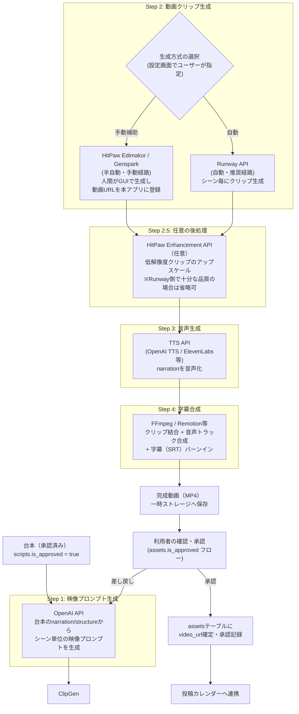

# 動画自動作成パイプライン 連携調査・設計書

> TikTok AI動画メディア管理Webアプリに組み込む「動画自動作成パイプライン」のための、HitPaw Edimakor / Genspark 連携可能性調査と推奨アーキテクチャ設計。

---

## 0. 結論の要約（先出し）

| 項目 | 結論 |
|---|---|
| HitPaw Edimakorの自動化 | **不可（実用レベルでは非推奨）**。公開API・CLIなし。デスクトップGUI専用、プロジェクトファイル(`.HVE`)は外部生成不可なバイナリ形式 |
| Gensparkの自動化 | **公開の動画生成APIなし**。Web UI操作のみ。ブラウザ自動化(RPA)は利用規約上のリスクが高く非推奨 |
| 推奨する動画クリップ生成手段 | **Runway API（公式）**を第一候補とする。理由：唯一「安定した公式REST API」を持ち、料金が明確、Sora APIのような廃止予定リスクがない |
| Sora API | 2026年9月24日に**sunset（提供終了）予定**であり新規採用は非推奨 |
| 実装方針 | HitPaw/Gensparkは「人間がGUIで操作する半自動ツール」として制作ボードに組み込み、**パイプラインの自動化部分はOpenAI（プロンプト・台本・TTS）+ Runway API（映像クリップ）+ 字幕合成ライブラリ**で構成する |

---

## 1. HitPaw Edimakor の自動化可能性調査結果

### 1.1 APIの有無
- `developer.hitpaw.com` にHitPawのAPIドキュメントが存在するが、これは**「HitPaw Enhancement API」**であり、画像/動画の**高画質化（アップスケール・ノイズ除去・顔補正）専用API**。AI Script Video GeneratorやAI動画編集機能とは**無関係**。
- Edimakor本体（動画編集・AIスクリプト動画生成）向けの公開REST API・SDKは**存在しない**。

### 1.2 コマンドラインインターフェース
- CLIは**存在しない**。Windows/Mac向けのGUIデスクトップアプリのみで、起動・操作は全てマウス/キーボード操作を前提とした設計。
- サポートページ（HitPaw公式FAQ）にもコマンドライン起動オプションの記載はない。

### 1.3 プロジェクトファイル形式
- プロジェクトは`.HVE`拡張子のファイルで保存される（独自バイナリ形式、フォーマット非公開）。
- 素材（動画・音声・画像）は**パス参照方式**で保存され、プロジェクトファイル自体に元素材は同梱されない。ファイルを移動すると「見つかりません」エラーになる仕様。
- 外部（スクリプト等）から`.HVE`ファイルを生成・書き換えすることは、フォーマットが非公開のため**事実上不可能**。

### 1.4 バッチ処理・自動化機能
- 「バッチ処理」を謳う機能はあるが、これは**同一の画質改善プリセットを複数ファイルに適用する**機能（HitPawの画像/動画エンハンサー製品群に共通）であり、台本→動画のような**創作系ワークフローの自動化ではない**。
- ヘッドレス実行や、外部トリガーによる無人実行に対応する仕組みは確認できなかった。

### 1.5 AI Script Video Generator の入出力仕様
- 入力：台本テキスト（またはメイン要点）をGUI上のテキストボックスに手動貼り付け。
- 処理：AIが台本を解析し、社内のストック動画ライブラリから関連クリップを自動マッチング、AI音声ナレーション・字幕・BGMを自動付加。
- 出力：GUIのタイムライン上にプレビュー表示され、人間が確認・編集してから「Export」ボタンで動画ファイル（MP4等）として書き出し。
- **すべてGUI操作起点**であり、テキスト入力から書き出しまでを外部から自動トリガーする手段はない。

### 1.6 連携可能な方法の全パターン（実現性評価）

| # | 方法 | 実現性 | 備考 |
|---|---|---|---|
| 1 | 公式REST API/SDK連携 | ✕ 不可 | 動画生成・編集APIが存在しない |
| 2 | CLI経由の自動実行 | ✕ 不可 | CLI自体が存在しない |
| 3 | `.HVE`プロジェクトファイルの外部生成 | ✕ 不可 | 非公開バイナリ形式 |
| 4 | Windows UI Automation / RPA（例：PyAutoGUI, Power Automate Desktop） | △ 技術的に可能だが非推奨 | GUI要素の座座標・構造がアプリ更新で頻繁に変化し破損しやすい。長期運用に不向き |
| 5 | HitPaw Enhancement API（画質改善のみ）の活用 | ○ 限定的に可能 | Runway等で生成した動画クリップの**後処理（アップスケール・ノイズ除去）**にのみ活用できる。動画「生成」自体には使えない |
| 6 | 人間がEdimakorをGUIで操作し、結果を本アプリにURL/ファイルとして登録 | ○ 実用的 | 完全自動化ではないが、制作ボードの「半自動ツール」として組み込み可能 |

**総合評価**：HitPaw Edimakorの自動化パイプライン組み込みは**技術的に極めて困難**。唯一実用的なのはパターン6（人間が使うツールとして案内する）と、パターン5（生成後の高画質化にAPIを使う）。

---

## 2. Genspark の API/自動化 調査結果

### 2.1 動画生成APIの有無と仕様
- Gensparkは「AI Video Generator」機能でSora, Vidu, Runway, Kling, Veo, PixVerse, Seedance等**14以上のモデルを1つのUIに集約**している。
- しかし、これらのモデルに対する**公開の動画生成REST API/SDKは提供されていない**（2026年8月時点の公式ヘルプセンター・開発者向け情報を調査した限り確認できず）。
- `@genspark/cli`（npm）というCLIツールは存在するが、これは`gsk search`等の**エージェント検索・ドキュメント生成用**であり、動画生成用エンドポイントは持たない。
- 「Genspark Code」（旧AI Developer）というコーディングエージェント機能はあるが、これはアプリ開発支援用で動画生成とは無関係。

### 2.2 認証方式
- Web UIはメール/Googleアカウント等による通常のログイン（ブラウザセッション）。
- `@genspark/cli`用にAPIキー（`gsk_...`）の発行機能はあるが、これは同CLIのSuper Agent検索機能向けであり、動画生成エンドポイントには紐づかない。

### 2.3 利用料金・無料枠
| プラン | 月額 | クレジット | 備考 |
|---|---|---|---|
| Free | $0 | 100クレジット/日 | サインアップ後の無料枠、動画生成は高クレジット消費のため実質数本/日 |
| Plus | $19.99〜$24.99 | 10,000クレジット/月 | 年払いで割引。チャット/画像生成はクレジット消費なし（2026年12月まで） |
| Pro | $199.99〜$249.99 | 125,000クレジット/月 | 全モデル・4K画像アクセス |

- 動画生成は「Sparkpage」等の他機能より**クレジット消費が大きい**（モデル・解像度・秒数により変動）。

### 2.4 対応モデルと特徴（Gensparkが集約しているもの）
| モデル | 特徴 |
|---|---|
| Sora / Sora-2 | OpenAI製、物理法則に忠実な描写。※OpenAI本体では2026/9/24 API終了予定 |
| Vidu / Vidu Q3 | 音声同期対応、1〜16秒 |
| Runway Gen-4 Turbo | 高速・アーティスティックなスタイル表現に強い |
| Kling 3.0 | キャラクターの一貫性・複雑な動きに強い |
| Google Veo 3.1 | 映画的な質感、リップシンク精度が高い |
| PixVerse V5/V6 | スタイライズされた映像を高速生成 |
| Seedance / Seedance Pro | 音声対応、コストパフォーマンスに優れる |
| Hailuo（MiniMax） | 滑らかなトランジション |

### 2.5 生成動画の品質・長さ制限
- モデルにより異なるが、多くは**4〜16秒程度**のクリップ生成が基本（Vidu Q3は最大16秒、Seedanceは4〜12秒等）。
- 解像度は720p〜1080p中心（モデル依存、一部4K対応モデルもGenspark経由で利用可）。
- 長尺動画（TikTok想定の15〜60秒）は、**複数クリップを繋いで編集する**運用が前提となる（各モデル共通の制約）。

### 2.6 APIがない場合のWeb自動化可能性
- Genspark利用規約には一般的なSaaSと同様、**自動化ツール・ボット・スクレイピングによるアクセスを制限する条項が想定される**（多くのAI SaaSで一般的な規約パターン。本調査では規約全文の確認まではできていないため、実装前に規約の再確認が必須）。
- ブラウザ自動化（Playwright/Puppeteer等でログイン・プロンプト入力・生成待機・ダウンロード）は**技術的には可能**だが、以下のリスクがある：
  - UIの頻繁な変更に対する保守コストが高い
  - 利用規約違反によるアカウント停止リスク
  - reCAPTCHA等のボット対策で失敗しやすい
  - 生成完了の待機時間が可変（数十秒〜数分）でタイムアウト設計が難しい
- **結論**：Web自動化は「最終手段」として技術的には成立し得るが、**規約リスクと保守コストの観点から推奨しない**。

---

## 3. 推奨パイプライン設計

### 3.1 設計方針
- HitPaw/Gensparkは**API化されていない**ため、完全自動パイプラインの「動画クリップ生成」ステップには**公式APIを持つRunway API**を第一候補として採用する。
- HitPaw EdimakorとGenspark自体は、**人間が任意で使う「制作ボードの補助ツール」**として位置づけ、生成物（動画URL・ファイル）を本アプリに手動登録する経路を残す（ユーザーが慣れたツールを使い続けられるようにする）。
- 既存の`mvp-plan.md`の方針（AI APIはサーバー側のみで呼ぶ、シークレット非露出、人間承認フロー必須）を継承する。

### 3.2 パイプライン全体フロー

### 3.3 各ステップの実装詳細

| Step | 処理内容 | 実行場所 | 使用サービス |
|---|---|---|---|
| 1. 映像プロンプト生成 | 台本のnarration/structure（秒数構成）を分割し、シーン毎の映像プロンプト（英語推奨、モデルの理解精度向上のため）を生成 | Next.js Server Action / API Route | OpenAI API（既存の`scripts.video_prompt`と連携） |
| 2. 動画クリップ生成 | シーン毎にプロンプトを送信しクリップ（4〜10秒程度）を非同期生成 | サーバー側ジョブ（後述の非同期処理設計） | Runway API（自動）／HitPaw・Genspark（手動、URL/ファイル登録のみ） |
| 2.5 後処理（任意） | 生成クリップの画質が不十分な場合のアップスケール | サーバー側 | HitPaw Enhancement API（画質改善専用） |
| 3. 音声生成 | narrationテキストをTTS音声化 | サーバー側 | OpenAI TTS API（既存スタックとの統一性を優先）、高品質音声が必要ならElevenLabs |
| 4. 字幕合成 | クリップ結合・音声トラック合成・字幕バーンイン | サーバー側（もしくはVercelの制約を考慮し外部ワーカー） | FFmpeg（サーバーレス環境での実行制約に注意、下記4章参照）または Remotion |
| 5. 完成・確認 | `assets`テーブルに登録、既存の承認フロー（`is_approved`, `approved_at`）を利用 | 既存のNext.jsアプリ | 既存DB設計をそのまま活用 |

### 3.4 非同期処理の必要性
- 動画生成（Runway API等）は**数十秒〜数分**かかるため、Vercelのサーバーレス関数のタイムアウト制約（Hobbyプランは最大10秒、Proでも最大300秒）に収まらない可能性が高い。
- 推奨：ジョブをキューに登録し、**Webhook（Runway APIはWebhook通知対応）またはポーリング**で完了を検知する非同期設計にする。
- `ai_workflow_logs`テーブルと同様の思想で、`video_generation_jobs`テーブル（job_id, status, step, result_url等）を新設し、ダッシュボードで進捗を可視化する設計を推奨。

---

## 4. 代替案の比較表

| サービス | 公式API | 料金（目安） | 無料枠 | 動画品質・長さ | Sunsetリスク | 総合評価 |
|---|---|---|---|---|---|---|
| **Runway API**（公式, dev.runwayml.com） | ○ 有り（REST, Webhook対応） | Gen-4 Turbo: 5クレジット/秒（$0.05/秒）、Gen-4.5: 12クレジット/秒（$0.12/秒） | 無し（$10最低チャージ制） | 720p〜1080p、5秒/10秒クリップ | 低（現行主力製品として継続開発中） | **推奨（第一候補）** |
| **OpenAI Sora API** | ○ 有り | sora-2: $0.10/秒（720p）、sora-2-pro: $0.30〜$0.70/秒（解像度依存） | 無し | 720p〜1080p、最大20秒 | **高：2026年9月24日 sunset予定** | 非推奨（新規採用リスク大） |
| **Genspark**（Web集約サービス） | ✕ 無し | Plus $19.99〜/月（10,000クレジット） | 100クレジット/日 | モデル依存（4〜16秒、720p〜1080p中心） | 低（サービス自体は成長中だが個別モデルAPIは提供しない） | 補助ツールとしてのみ活用 |
| **HitPaw Edimakor**（デスクトップ） | ✕ 無し | 買い切り/サブスク（要確認、本調査では価格ページ詳細未確認） | 体験版あり（機能制限） | ストック動画ベースの合成、品質は素材依存 | 低 | 補助ツールとしてのみ活用 |
| **Kling AI**（参考） | 一部API提供あり（サードパーティ経由が主） | 標準$10/月〜、Pro $37/月〜 | 限定的な無料トライアル | 1080p中心 | 低 | 次点の代替候補 |
| **Google Veo 3.1**（参考） | Gemini API経由で提供 | 音声有り：40クレジット/秒相当（Runway経由の場合） | 無し | 1080p、リップシンク精度高い | 低 | 予算に余裕があれば検討可 |

### 判断基準の整理
1. **公式APIの有無**：Runway・Sora・Veoのみが該当。GensparkとHitPawは非対応。
2. **Sunsetリスク**：Sora APIは明確な終了予定日があり新規採用は避けるべき。
3. **料金の透明性**：Runwayは`$0.01/クレジット`の明確な料金体系で予算管理しやすい。
4. **TikTok用途との適合性**：TikTok動画は15〜60秒が主流のため、4〜10秒クリップを複数生成して結合する運用が前提になる（どのサービスを選んでも同様の制約）。

---

## 5. 必要な外部サービスと料金（想定構成）

| サービス | 用途 | 料金目安 |
|---|---|---|
| OpenAI API（既存） | 台本生成・映像プロンプト生成・TTS音声生成 | 既存の`mvp-plan.md`記載の想定と同様（数百円〜数千円/月、利用量次第） |
| Runway API | 動画クリップ生成（メイン） | $0.05/秒（Gen-4 Turbo）が目安。1本30秒のTikTok動画（3クリップ×10秒）で約$1.5/本。月20本生成なら約$30/月 |
| （任意）HitPaw Enhancement API | クリップの画質改善（後処理） | 個別見積り、本調査では詳細な単価情報は未取得。導入時に別途価格確認が必要 |
| （任意）ElevenLabs | 高品質TTS（OpenAI TTSで不足する場合） | 従量課金、無料枠あり |
| FFmpeg実行環境 | 動画結合・字幕合成 | Vercel上での長時間処理制約のため、Cloudflare Workers / AWS Lambda（コンテナ）/ 専用ワーカー（Render, Railway等）の追加費用を検討要 |
| （任意）ジョブキュー | 非同期処理管理 | Upstash QStash（無料枠あり）、Inngest（無料枠あり）等が候補 |

---

## 6. 実装上の注意点・制約

1. **HitPaw/Gensparkは自動化パイプラインに組み込めない**ため、これらを「必須ステップ」として設計しない。あくまで「人間がGUIで作業する補助ツール」として制作ボードから参照リンクを案内する形に留める。
2. **Sora APIは新規採用しない**（sunset予定が明確なため）。既存資料に「将来: 動画生成AI」とあるが、Runway APIを優先候補として明記する必要がある。
3. **Vercelのタイムアウト制約**：動画生成・字幕合成は長時間処理になるため、Server Actions内で同期的に完結させることはできない。非同期ジョブ設計（キュー＋Webhook/ポーリング）が必須。
4. **FFmpeg実行環境**：Vercelのサーバーレス関数はネイティブバイナリの実行に制約があるため、字幕合成・クリップ結合は別ホスティング（コンテナ実行環境）を用意するか、Remotion Lambda等のマネージドサービスを検討する。
5. **コスト管理**：Runway APIは従量課金のため、既存の`mvp-plan.md`同様に使用量監視・上限設定を必須にする。特に動画生成は1回の失敗（意図しない映像）でも課金されるため、プレビュー→再生成の回数に上限を設ける運用ルールが必要。
6. **著作権・規約リスク**：AI生成映像も既存の「規約リスク自動判定（低・中・高）」の対象に含め、人物の実写に近い生成や実在ブランドを想起させる映像は高リスク判定にする。
7. **人間承認フローの徹底**：既存方針通り、動画の完成後は必ず`assets.is_approved`による人間確認を経てから投稿カレンダーに反映する。生成AIステップを増やしても、この承認ゲートは変更しない。
8. **Genspark/HitPawの利用規約再確認**：本調査はWeb公開情報に基づく調査であり、両サービスの最新の利用規約（特に自動化・API利用・商用利用条件）は実装着手前に必ず原文を再確認すること。

---

## 7. 推奨する実装方針の結論

1. **動画クリップ生成の自動化にはRunway API（公式）を採用する。** 唯一、料金体系が明確でSunsetリスクが低い公式APIであるため。
2. **HitPaw EdimakorとGensparkは自動化パイプラインの構成要素としない。** 両者ともAPIが存在しない（HitPawの公開APIは画質改善専用、Gensparkは非公開）ため、無人の自動実行はできない。
3. **既存の`mvp-plan.md`のPhase 2構想（動画生成AI連携）を「Runway API連携」として具体化する。** アーキテクチャ図中の`FutureVideo`を`Runway API`に置き換える形で進める。
4. **パイプラインは非同期ジョブ設計にする。** OpenAI（プロンプト・TTS）→Runway API（クリップ生成、Webhook待ち）→字幕合成（別ワーカー）→人間承認、という順で`video_generation_jobs`テーブルを新設して進捗管理する。
5. **HitPaw/Gensparkは「制作ボードの補助ツールリンク」として案内する。** ユーザーが手動でこれらのツールを使い、生成した動画URLを`assets`テーブルに登録する経路を維持し、完全自動化を強制しない柔軟性を持たせる。
6. **Sora APIは採用しない。** 2026年9月24日のsunset予定により、新規統合の投資対象として不適切。
